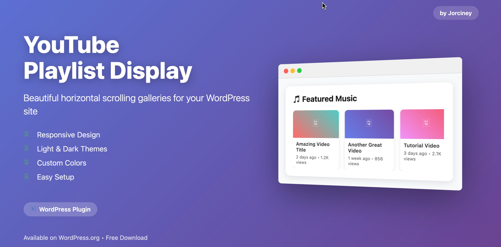
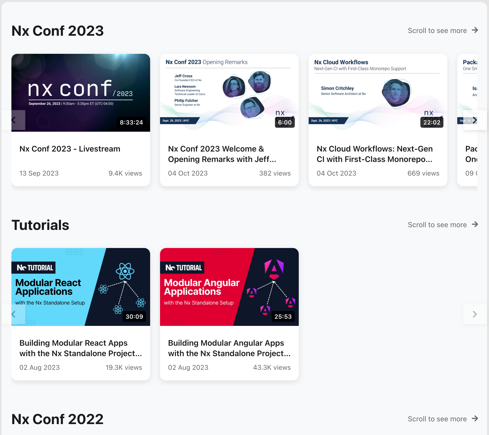
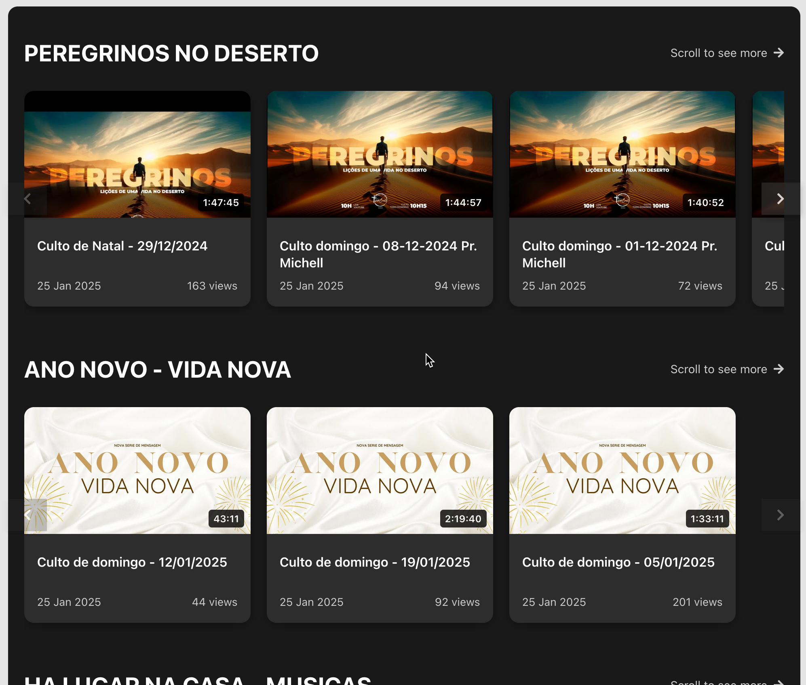
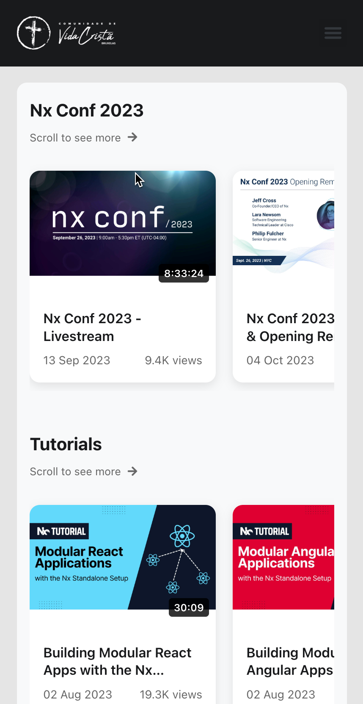
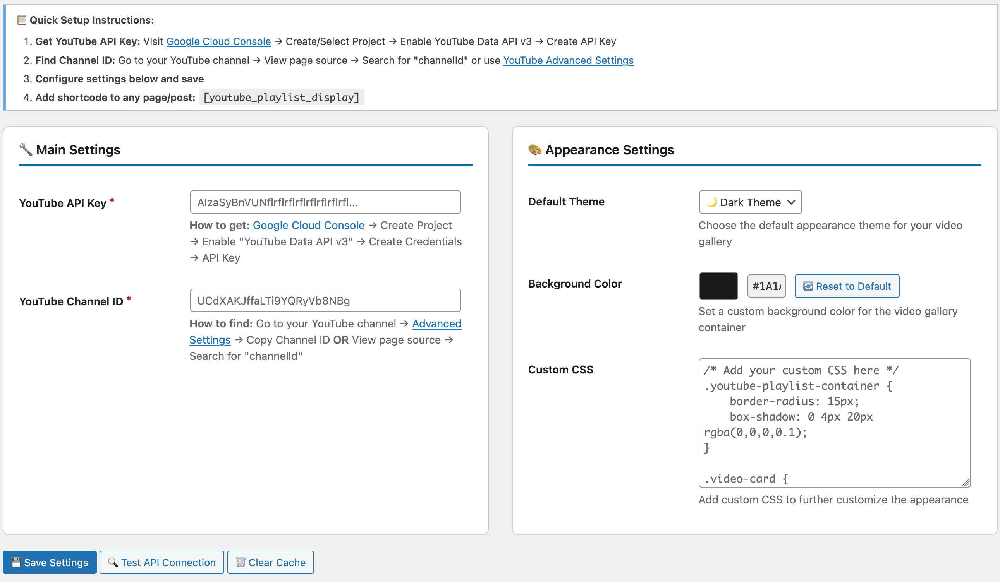
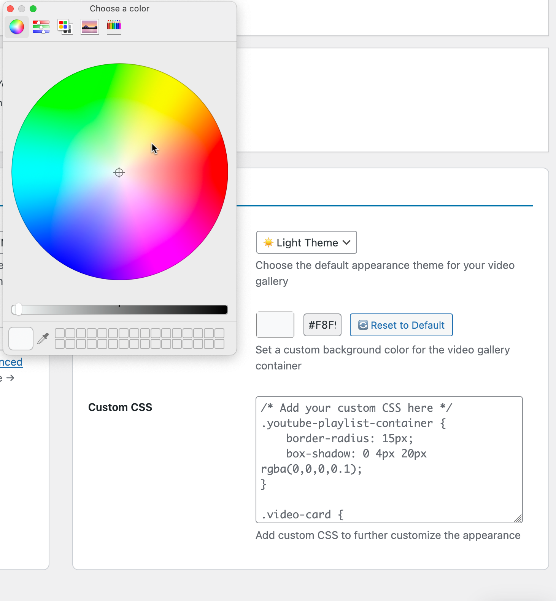
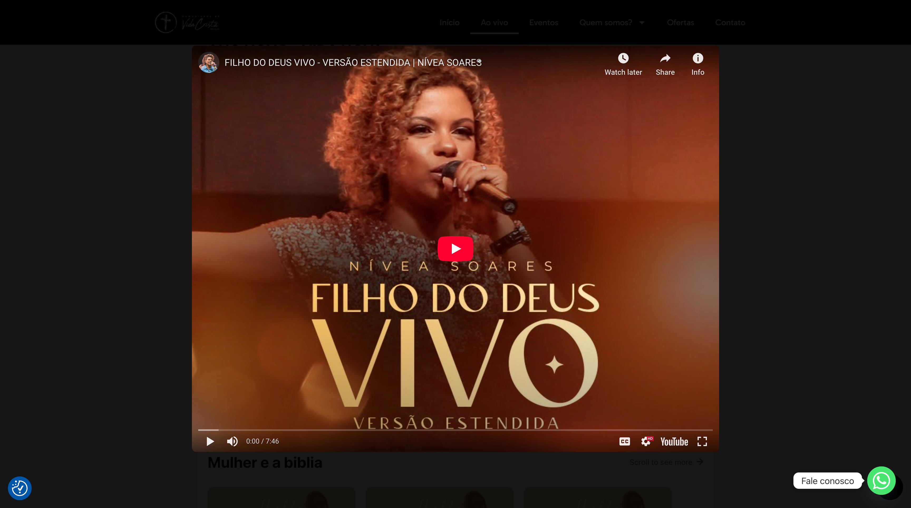

# Display YouTube Playlists

[](https://wordpress.org/plugins/display-youtube-playlists/)
[](https://wordpress.org/plugins/display-youtube-playlists/)
[](https://wordpress.org/plugins/display-youtube-playlists/)
[](https://www.gnu.org/licenses/gpl-2.0.html)

Transform your WordPress site with stunning YouTube playlist galleries! **Display YouTube Playlists** creates beautiful, responsive horizontal scrolling layouts that showcase your channel's playlists professionally.

Perfect for content creators, churches, educational sites, businesses, and musicians who want to showcase their YouTube content elegantly on their WordPress websites.



## 🎨 Key Features

- **Customizable Themes** - Light and dark themes with custom background colors
- **Responsive Design** - Mobile-first design that works perfectly on all devices
- **Easy Configuration** - Visual admin panel with real-time API connection testing
- **Performance Optimized** - Smart caching system and lazy loading for fast page speeds
- **Custom CSS Support** - Advanced styling options for developers and designers
- **One-Click Setup** - Simple shortcode implementation `[display_youtube_playlists]`
- **Color Picker** - Choose any background color to match your brand
- **Cache Management** - Built-in cache system with one-click clearing
- **Debug Mode** - Helpful troubleshooting tools for administrators

## 🎯 Perfect For

- **Content Creators** - Showcase video portfolios and latest uploads
- **Churches** - Display sermon series and spiritual content
- **Educational Sites** - Organize course content and tutorials
- **Businesses** - Feature product demonstrations and testimonials
- **Musicians** - Share latest releases and music videos
- **Podcasters** - Display video podcast episodes
- **Fitness Instructors** - Showcase workout routines and classes

## 🚀 Quick Start

1. Get your free YouTube API key from [Google Cloud Console](https://console.developers.google.com)
2. Find your YouTube Channel ID
3. Configure the plugin settings in WordPress admin
4. Add `[display_youtube_playlists]` shortcode to any page or post
5. Enjoy beautiful, professional video galleries!

## 📥 Installation

### WordPress Plugin Directory (Recommended)

1. Go to **Plugins → Add New** in your WordPress admin dashboard
2. Search for "Display YouTube Playlists"
3. Click **Install Now** and then **Activate**
4. Go to **Settings → Display YouTube Playlists** to configure

### Manual Installation

1. Download the latest release from the [WordPress Plugin Directory](https://wordpress.org/plugins/display-youtube-playlists/)
2. Upload the plugin files to `/wp-content/plugins/display-youtube-playlists/`
3. Activate the plugin through the WordPress admin
4. Configure the plugin in **Settings → Display YouTube Playlists**

## ⚙️ Configuration

### Getting Your YouTube API Key

1. Visit [Google Cloud Console](https://console.developers.google.com)
2. Create a new project or select an existing one
3. Enable **YouTube Data API v3**
4. Create credentials → **API Key**
5. Copy the API key to plugin settings

### Finding Your Channel ID

**Method 1 (Easiest):**
1. Go to your YouTube channel
2. Visit [YouTube Advanced Settings](https://www.youtube.com/account_advanced)
3. Copy your **Channel ID**

## 🎨 Customization

### Shortcode Options

```php
// Basic usage
[display_youtube_playlists]

// Dark theme
[display_youtube_playlists theme="dark"]

// Custom background color
[display_youtube_playlists background="#ff5733"]

// Limit videos per playlist
[display_youtube_playlists max_videos="10"]

// Combined options
[display_youtube_playlists theme="dark" background="#2d2d2d" max_videos="12"]

// Debug mode (admins only)
[display_youtube_playlists debug="true"]
```

### Custom CSS

Add custom styles in the plugin's CSS editor:

```css
.dyp-video-card {
    border: 2px solid #your-color;
    border-radius: 15px;
}
```

## 📱 Mobile-First Design

- **Touch-friendly scrolling** on mobile and tablets
- **Adaptive layouts** that adjust to any screen size
- **Fast loading** with optimized images and lazy loading
- **Accessible design** with proper ARIA labels and keyboard navigation

## ⚡ Performance Features

- **Smart Caching** - Playlists cached for 2 hours, videos for 1 hour
- **Lazy Loading** - Images load only when needed
- **Optimized API Calls** - Efficient YouTube Data API usage
- **Minimal Resource Usage** - Lightweight code that won't slow your site

## 🛡️ Security & Privacy

- **No Data Collection** - Plugin doesn't collect any visitor data
- **Secure API Calls** - All YouTube requests are server-side only
- **Sanitized Inputs** - All user inputs properly sanitized and validated
- **Nonce Protection** - Admin forms protected against CSRF attacks

## 🌍 Developer Friendly

- **Clean Code** - Well-documented, standards-compliant PHP
- **Translation Ready** - Text domain ready for internationalization
- **Hook System** - WordPress hooks for extensibility
- **Open Source** - Available on GitHub for contributions
- **Semantic Versioning** - Predictable version numbering

## 📸 Screenshots

| Light Theme | Dark Theme | Mobile View |
|-------------|------------|-------------|
|  |  |  |

| Admin Panel | Color Picker | Video Modal |
|-------------|--------------|-------------|
|  |  |  |

## 📋 Requirements

- **WordPress:** 5.0 or higher
- **PHP:** 7.4 or higher
- **YouTube Data API v3:** Free Google Cloud account required

## 🔄 Changelog

### 2.0.0 (2024-12-20)
- **New:** Configurable background colors with visual color picker
- **New:** Reset button to restore default theme colors
- **New:** Custom CSS editor for advanced styling options
- **New:** Real-time API connection testing with detailed feedback
- **New:** One-click cache management system
- **New:** Enhanced debug mode with comprehensive information
- **Improved:** Admin interface with better UX and visual design
- **Improved:** Mobile responsiveness and touch interactions
- **Fixed:** CSS conflicts with some WordPress themes

### 1.0.0 (2024-11-15)
- Initial release with core functionality

## 🤝 Contributing

Contributions are welcome! Please feel free to submit a Pull Request.

1. Fork the repository
2. Create your feature branch (`git checkout -b feature/AmazingFeature`)
3. Commit your changes (`git commit -m 'Add some AmazingFeature'`)
4. Push to the branch (`git push origin feature/AmazingFeature`)
5. Open a Pull Request

## 📞 Support

- **WordPress.org Support Forum** - Community support
- **GitHub Issues** - Bug reports and feature requests
- **Documentation** - Complete guides at [jorciney.dev](https://jorciney.dev)
- **Email Support** - Direct developer contact

## 💖 Support the Project

If you find this plugin helpful, consider:

- ⭐ **Star this repository**
- 🔄 **Share with others**
- 💰 **[Buy me a coffee](https://coff.ee/jorciney)**
- 📝 **Leave a review** on WordPress.org

## 📄 License

This project is licensed under the GPL v2 or later - see the [LICENSE](https://www.gnu.org/licenses/gpl-2.0.html) file for details.

## 👨‍💻 Author

**Jorciney**
- Website: [jorciney.dev](https://jorciney.dev)
- GitHub: [@jorciney](https://github.com/jorciney)
- Plugin URI: [Display YouTube Playlists](https://jorciney.dev/wp-plugins/display-youtube-playlists/)

---

Made with ❤️ for the WordPress community.